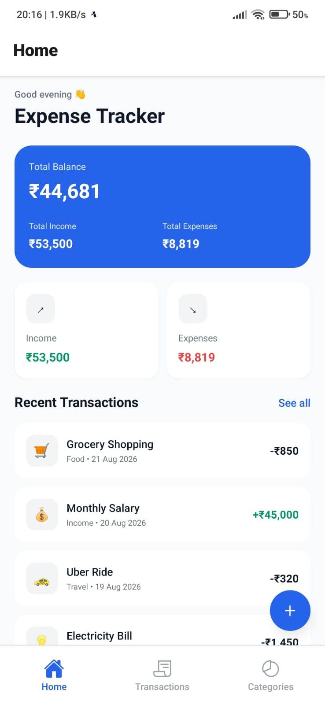
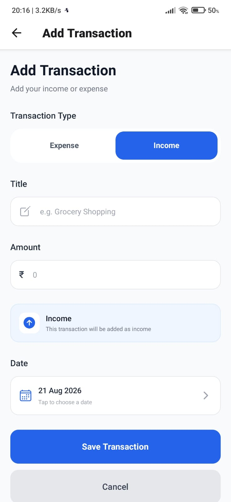
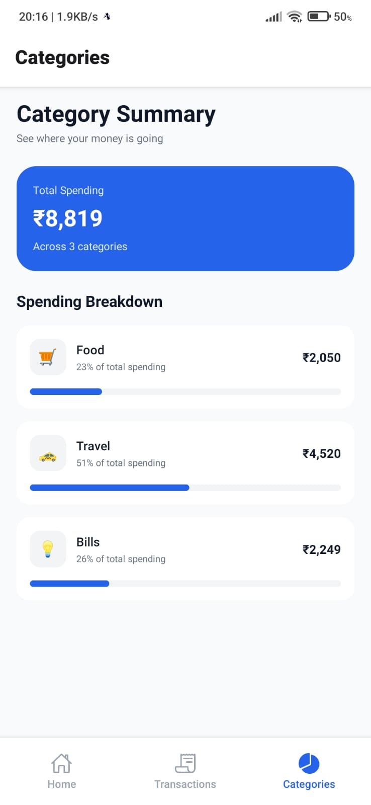

# 💰 Expense Tracker App

A mobile Expense Tracker application built using **React Native, Expo, NativeWind, and React Navigation**.

The application provides a clean and production-style interface for tracking income and expenses, viewing transactions, filtering transactions by category, adding new transactions, and understanding spending through category summaries.

This project was developed as part of a **Frontend Internship Assessment**.

---

## 📱 Project Overview

The Expense Tracker is a **UI-only mobile application**.

All transaction information is provided through local mock data. The application does not use any backend, API, database, or external data source.

The main focus of the project is:

- Clean mobile UI
- React Native development
- NativeWind styling
- Navigation
- Component-based structure
- Transaction filtering
- Form validation
- Responsive user experience
- Spending visualization

---

## ✨ Features

- Dashboard with total balance
- Total income and total expenses
- Recent transactions
- Quick-add transaction button
- Complete transactions list
- Transaction filtering
- Food, Travel, Bills, and Income categories
- Add income or expense
- Transaction title input
- Amount input
- Category selection
- Date input
- Income / Expense selection
- Input validation
- Keyboard-friendly transaction form
- Category spending summary
- Spending percentage
- Visual spending progress bars
- Bottom tab navigation
- Stack navigation
- Local mock data
- Responsive mobile layout

---

# 📱 Screens

## 1. Dashboard / Home

The Home screen provides an overview of the user's finances.

It includes:

- Total Balance
- Total Income
- Total Expenses
- Income summary
- Expense summary
- Recent Transactions
- Quick Add Transaction button

The recent transactions section displays the latest transaction entries.

---

## 2. Transactions

The Transactions screen displays the complete list of transactions.

Each transaction contains:

- Transaction title
- Category
- Category icon
- Date
- Amount
- Income or expense indication

### Filters

Transactions can be filtered instantly using:

- All
- Food
- Travel
- Bills
- Income

The selected filter is visually highlighted.

---

## 3. Add Transaction

The Add Transaction screen allows the user to enter a new transaction.

The form contains:

- Transaction title
- Amount
- Category selector
- Date
- Income / Expense selector
- Save button
- Cancel button

### Validation

The form validates:

- Empty transaction title
- Empty amount
- Invalid amount
- Zero or negative amount
- Empty date

The amount field accepts numeric values and prevents letters and negative values.

The screen also uses keyboard-aware layout handling so that the keyboard does not cover form fields.

---

## 4. Category Summary

The Category Summary screen provides a visual breakdown of expenses.

It displays:

- Total spending
- Food spending
- Travel spending
- Bills spending
- Percentage of total spending
- Visual progress bars

The summary is calculated from the local mock transaction data.

---

## 5. Empty and Validation States

The application includes validation feedback on the Add Transaction screen.

When required information is missing or invalid, an inline error message is displayed instead of silently submitting the form.

The transaction list also supports an empty state when there are no transactions to display.

---

# 🛠️ Tech Stack

### Frontend

- React Native
- Expo SDK 54
- JavaScript

### Styling

- NativeWind
- Tailwind CSS

### Navigation

- React Navigation
- Native Stack Navigator
- Bottom Tab Navigator

### Data

- Local mock JavaScript data
- No backend
- No API calls
- No external database

---

# 📂 Project Structure

```text
expense-tracker-app/
│
├── assets/
│
├── components/
│   ├── SummaryCard.js
│   └── TransactionCard.js
│
├── data/
│   └── mockData.js
│
├── screens/
│   ├── HomeScreen.js
│   ├── TransactionsScreen.js
│   ├── AddTransactionScreen.js
│   └── CategorySummaryScreen.js
│
├── App.js
├── index.js
├── app.json
├── babel.config.js
├── metro.config.js
├── tailwind.config.js
├── global.css
├── package.json
├── package-lock.json
├── .gitignore
└── README.md
```

---

# 🚀 Getting Started

## Prerequisites

Make sure the following are installed:

- Node.js
- npm
- Expo Go

## Installation

Clone the repository:

```bash
git clone https://github.com/Aishwaryaschakote/expense-tracker-app.git
```

Navigate to the project folder:

```bash
cd expense-tracker-app
```

Install dependencies:

```bash
npm install
```

## ▶️ Run the Application

Start the Expo development server:

```bash
npx expo start
```

Scan the QR code using Expo Go on your Android device.

Make sure your computer and mobile device are connected to the same network.

---

# 🧪 Testing the Application

## Home / Dashboard

1. Open the application.
2. Check the total balance.
3. Check total income and expenses.
4. Check the recent transactions.
5. Tap the `+` button to open Add Transaction.

## Transactions

1. Open the Transactions tab.
2. Select `All`.
3. Select `Food`.
4. Select `Travel`.
5. Select `Bills`.
6. Select `Income`.
7. Verify that the transaction list updates according to the selected filter.

## Add Transaction

1. Open Add Transaction.
2. Select Income or Expense.
3. Enter a transaction title.
4. Enter an amount.
5. Select a category.
6. Enter a date.
7. Tap Save Transaction.
8. Test validation by leaving required fields empty.
9. Test the amount field with invalid characters.

## Category Summary

1. Open the Categories tab.
2. Check total spending.
3. Check category totals.
4. Check spending percentages.
5. Check the visual progress bars.

---

# 🎨 Design

The application uses a consistent visual style across all screens.

### Design characteristics

- Clean white cards
- Light gray background
- Blue primary actions
- Green income indicators
- Red expense indicators
- Rounded cards
- Rounded buttons
- Clear typography
- Consistent spacing
- Mobile-friendly layout

All application styling is implemented using NativeWind utility classes.

---

# 📊 Mock Data

This project uses local mock data only.

Transaction data is stored in:

```text
data/mockData.js
```

Example categories:

- Food
- Travel
- Bills
- Income

Example transactions:

- Grocery Shopping
- Monthly Salary
- Uber Ride
- Electricity Bill
- Freelance Project
- Restaurant Dinner
- Flight Tickets
- Internet Bill

No external data source is required.

---

# 🔒 No Backend / API

This is a UI-only application.

The project does not use:

- API calls
- Backend services
- Database
- Authentication services
- External data fetching

All application data comes from local mock data.

---

# 📱 Navigation

The application uses React Navigation with Stack Navigation and Bottom Tab Navigation.

### Bottom Tabs

```text
Home
Transactions
Categories
```

### Stack Navigation

```text
Main
├── Home
├── Transactions
└── Categories

Add Transaction
```

The Add Transaction screen is opened from the Dashboard using the quick-add button.

---

# 🧩 Component Structure

The application uses reusable functional components.

### SummaryCard

Used for displaying income and expense summary information.

### TransactionCard

Used to display individual transaction information consistently across the application.

The screens and components are kept separate to make the project easier to maintain and understand.

---

# ⚡ Edge Cases

The application handles the following cases:

- Empty transaction title
- Empty amount
- Zero amount
- Negative amount
- Invalid amount characters
- Category filtering
- Empty transaction list
- Long transaction titles
- Keyboard covering form fields
- Validation errors

Long transaction titles are truncated to prevent layout overflow.

---

# 📸 Screenshots

Screenshots of the application will be added to this section before final submission.

## 📸 Screenshots

## Home / Dashboard



## Transactions


## Add Transaction



## Category Summary



---

# 📋 Assessment Requirements Covered

| Requirement | Status |
|---|---|
| Dashboard / Home | ✅ |
| Total balance | ✅ |
| Total income | ✅ |
| Total expenses | ✅ |
| Recent transactions | ✅ |
| Quick-add button | ✅ |
| All transactions | ✅ |
| Category filtering | ✅ |
| Add Transaction | ✅ |
| Income / Expense selection | ✅ |
| Amount validation | ✅ |
| Category Summary | ✅ |
| Spending breakdown | ✅ |
| Progress bars | ✅ |
| React Navigation | ✅ |
| Bottom Tabs | ✅ |
| Stack Navigation | ✅ |
| NativeWind styling | ✅ |
| Local mock data | ✅ |
| No backend/API | ✅ |
| Functional components | ✅ |
| README | ✅ |

---

# 👩‍💻 Author

**Aishwarya Chakote**

Computer Science & Engineering

Frontend / Software Development

---

# 📄 License

This project was created for educational and internship assessment purposes.
